# Chapter 2 — Connecting to Data Sources and Power Query

## Microsoft Power BI Data Analyst Associate (PL-300)


Topics:

* Data connectors
* Import mode
* DirectQuery introduction
* Data transformation
* Query folding
* Parameters
* Merge vs Append
* Data types
* Data gateways
* PL-300 connectivity scenarios

---

# Chapter Objectives

After completing this chapter, learners should understand:

* How Power BI connects to different data sources
* The difference between connectors and storage modes
* Import vs DirectQuery fundamentals
* Power Query's role in data preparation
* Query transformations
* Query folding
* Merge vs Append
* Data profiling
* Parameters
* Data gateways
* Common PL-300 connectivity scenarios

---

# 2.1 Connecting to Data Sources

Power BI can connect to many different types of data sources.

Common sources include:

## Files

Examples:

* Excel
* CSV
* XML
* JSON
* PDF

---

## Databases

Examples:

* SQL Server
* PostgreSQL
* Oracle
* MySQL

---

## Microsoft Services

Examples:

* SharePoint
* Dataverse
* Azure services

---

## Online Services

Examples:

* Salesforce
* Google Analytics

---

# How we bring data to powerbi??

- Open Powerbi Desktop

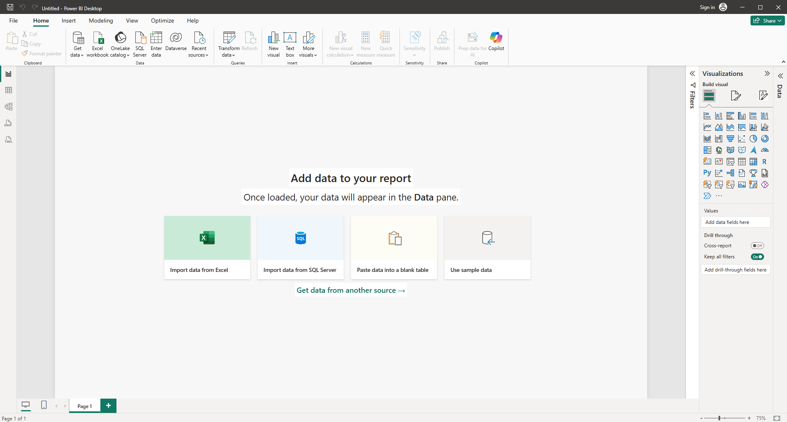

- In the home tab we find Data Group, there we have get data where we can fetch the data from various sources.
- Some of popular data sources are pinned in data group


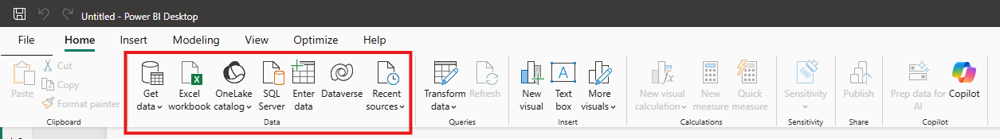

- IF we extend get data we find other available data sources 

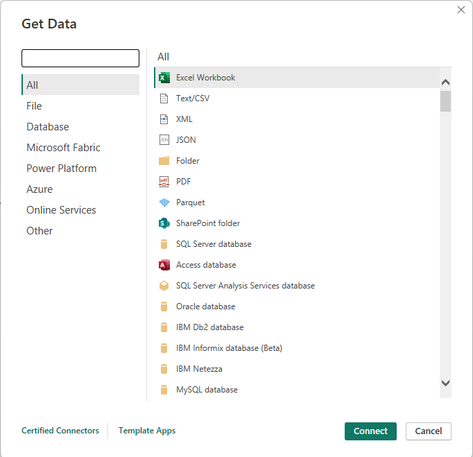


### Data Sources: 
This is where our data actually lives, This is the original source of our data and everything lives completely outside of powerbi  ex: CSV, Excel, Sql server


### PowerBi Desktop
- `Data Layer`: This is the raw data that powerbi brings from the sources. This is just a local copy of your data.
- `Model Layer`: This is where we describe and organize your data, here we have tables, columns and relations between tables to each other. SO it’s just like structure a  description of our data but not the data itself.
- `Visual Layer`: This where we build our reports using visuals like charts, bars, slicers

All these three layers always work together

Example: If you want to create a new visual or you are interacting with it powerbi send a request to the model in order to get the data and the model going to prepare the final result and send it back the visual


# 2.2 Connectors vs Storage Modes

A common PL-300 confusion is mixing these concepts.

They answer different questions.

---

# Connector

Question answered:

> "Where does my data come from?"

Examples:

* Excel connector
* SQL Server connector
* SharePoint connector


### Why undersanding Connectivity Modes Matters?

Choosing the right connectivity / Storage mode Impacts 
    - Performance of visuals & Reports
    - Data freshness and latency
    - Data Model capabilites(Dax transformations)
    - Governance, data size & costs.
- Incorrect choice leads to bottleneccks:slow reports,stale data, or model limitations.

- Each mode has its own advantages and limitations, so understanding them helps in making informed decisions when designing Power BI solutions.


---

# Storage Mode

Question answered:

> "How does Power BI interact with the data?"

Examples:

* Import
* DirectQuery
* Dual

---

Example:

A report can use:

 SQL Server Connector with either:

Import  Mode OR DirectQuery Storage Mode


- For PowerbI to do anything it need data ,In order to get the data  we need to make a  connection between Powerbi and  the source of the data.

- And Depend on the type of the source we have connecting we have few great options

- If we are connecting completely new data source we have import, direct query and dual.

- And we also have fourth connection called live connection ,we use this when we are connecting powerBi  to reuse something that already exist in the powebi sevice


---

# 2.3 Import Mode

Import mode loads data into the Power BI semantic model.


- Data is copied from the source and stored locally inside the powerBi file, Then used for visuals

- In Import mode: Data is copied from the source into powerbi's in memory engine(Vertipaq) and then used for visuals,And query the imported data(faster) instead of going back to the source for every interaction.

Process:

```id="8ok5as"
Data Source

↓

Power BI

↓

In-Memory Model

↓

Reports
```

---

# Advantages

- ✅ High performance For Interactions(because data is locally stored in memory)
- ✅ Full modeling/transformation support (DAX, calculated tables )functionality
- ✅ Supports combining multiple sources types(files, DB's)
- ✅ Data compression

---

# Disadvantages

- ❌ Data is not automatically current
- ❌ Requires refresh


- Example we have csv files that are loaded in power bi using import mode it creates a local copy inside the powerbi and stores  inside in the data layer.


#### When we see data in the visuals where does it come from? Is it from the files from local copy or data sources?

Since we are using the import mode powerbi doesn’t  go back to the data source of the files everything going to stay inside Powerbi. In short it only uses local copy


## How to import data in import mode?
- In order to import the data we have to go to the source and get the data and copy it inside powerbi file and store it in memory for future use.


- In home Tab-> Under data Group -> Getdata-> choose the data source-> select the filesIn home Tab-> Under data Group -> Getdata-> choose the data source-> select the files


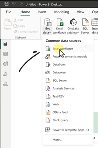


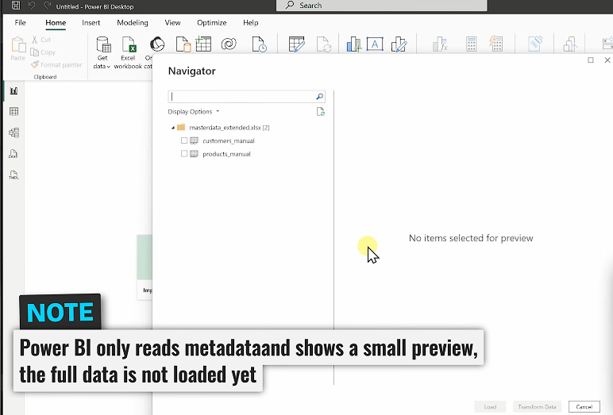


- Here powerbi Connected to our files Nothing is loaded yet it is just grabbing the structure of the files and few data in order to review it


### How to load the data?
- If You are connecting files to powerbi you have only one option to import the data. So you can’t establish any other type like live connection.

- Example Some files can only be imported and there’s no other connection types are available. Ex: Excel,CSV

- In the model view we have tables if this symbol is shown We can assume that it is import mode

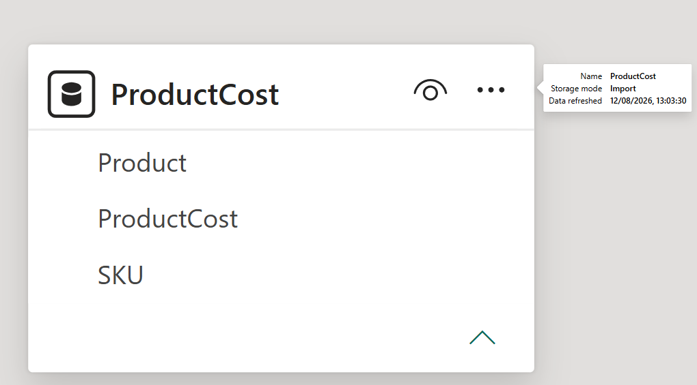


### Changing the storage mode of a table

- In order to change the storage mode we can select the type of connection we want to use for this table

### How to Change storage Mode It
- Go to Model view.

- Select the table.

- In the Properties pane, under Advanced, find Storage mode.

- Choose Import, DirectQuery, or Dual (if available).

- If the Storage mode dropdown is greyed out , it means:

    - The data source doesn’t support DirectQuery.

    - The model isn’t a composite model.

    - Or the table is dependent on other tables that restrict mode changes.


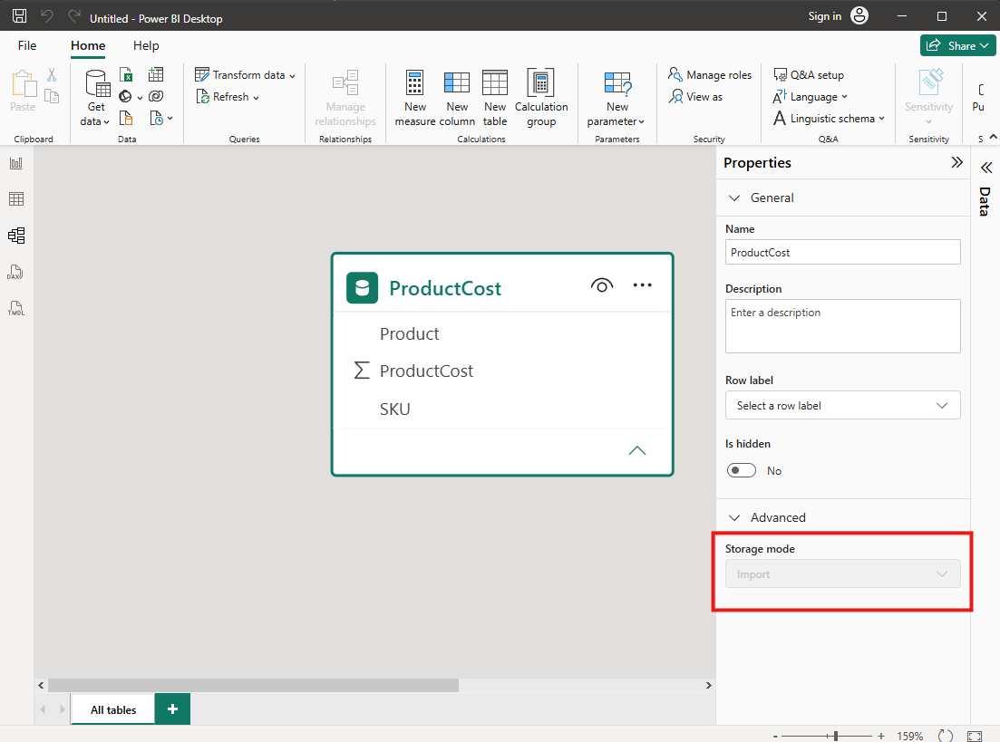

- In import mode we can change the storage mode to direct query or dual but in direct query we can’t change it to import mode because it is not supported. 


### Main Limitation of import mode
If the source file changes , powerbi doesn’t update automatically, so you work with outdated data.

Example: we have a excel file with some data and when we load it in powerbi it creates a local copy with data at that time, so any changes happen in excel file doesn’t reflect in powerbi  so we work with outdated data.

### How to solve this issue?
For import we have another process called the Refresh process
As we know that in import mode  everything going to happen inside powerbi and doesn’t go to external sources until we trigger the refresh process.

This is the only moment where powerbi has to go back ,so now during the refresh ,powerbi has to repeat the whole import process that means powerbi has to go and connect again to the original file and start reading everything.

So when we connect the data again it creates a copy of that new data and replaces with old data and starts working with model layer and visual layer


## How to refresh the data in import mode?
- In order to refresh the data we have to go back to the source and get the latest

- In the Home tab we have refresh button click on it to refresh the data


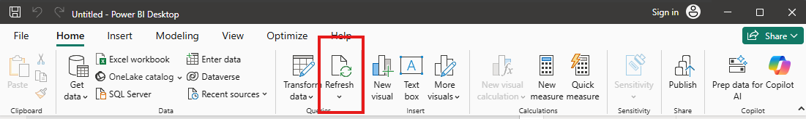

Example: we have excel file and we already loaded it in powerbi and now we have few changes in excel file and we want to reflect that inside the powerbi by simply clicking on the refresh button we can bring those changes to powerbi.

This is the main drawback of import we have to do it  manually.
- For Powerbi Desktop : we refresh data manually.
- For Powerbi Service: we can schedule automatic refresh.

We can create a scheduleuler refresh example: two times a day or some thing like that in order to refresh the data from the sources by loading it from there into Powerbi service. 
So we can automate the whole thing without us manually clicking on refresh.


---

# Refresh Process

Example:

```id="7l1b7f"
Database

↓

Scheduled Refresh

↓

Updated Semantic Model
```


## When it’s is idle  to use?
-	This is idle when our report is scheduled on a daily basis

## What is meant by scheduling your data ?
-	So every time you want a report to run at a specified time of a day
-	Example you want  your report to be refreshed at any standpoint in a day that’s when this particular mode provides it’s highest functional capability and also gives out functional and limitless refresh time.
-	Only the data that is available on your memory engine and not to the latest or real time data that is available on your database.
-	In Import mode we are only dealing with a chunk of data that is already available on our memory engine.
-	Example:
-	I have a database on my system and I tried to load 300 set of records onto my powerbi memory engine and once that particular section or that particular data has been imported onto your memory engine  it’s only that 300 record that you’re going to see at that point of time and at the backend if I changing certain data that is available on my database if any updates in my particular data is not readily available in import mode that can be considered limitiations or drawbacks
-	There would be certain cases where we would require our realtime data or we would need to see the actual data that is in force with our database at that scenarios import mode doesn’t actually come into frame where we use different modes
-	Import  doesn’t sutiable for large data set


## Size Limit For Power BI Data
- In Power BI Desktop, there is no data volume limitation for a load.
However, when you want to publish a .pbix file to Power BI Service, the dataset of a single `.pbix file must be smaller than 1 GB`. 
- `Power BI Premium` supports uploads of Power BI Desktop (.pbix) files that are up to `10 GB` in size. Once uploaded, a dataset can be refreshed to up to `12 GB` in size. To use a large dataset, publish it to a workspace that is assigned to Premium capacity.
- `Distinct values` in a column - When caching data in a Power BI dataset (sometimes called 'Import' mode), there is a `1,999,999,997(one billion, nine hundred ninety-nine million, nine hundred ninety-nine thousand, nine hundred ninety-seven.)` limit on the number of distinct values that can be stored in a column.
 
- `Row limit` - When using DirectQuery, Power BI imposes a limit on the query results that are sent to your underlying data source. If the query sent to the data source returns more than one million rows, you see an error and the query fails. Your underlying data can still contain more than one million rows. You're unlikely to run into this limit as most reports aggregate the data into smaller sets of results.
There is no strict limit, but a well-optimized dataset typically holds between 100–120 million rows in a 1 GB file
 
- `Column limit` - The maximum number of columns allowed in a dataset, across all tables in the dataset, is `16,000 columns`. This limit applies to the Power BI service and to datasets used in Power BI Desktop. Power BI tracks the number of columns and tables in the dataset in this way, which means the maximum number of columns is 16,000 minus one for each table in the dataset.
- `Compression`: Because Power BI uses an in-memory x Velocity database, raw data is highly compressed (sometimes by up to 10x), meaning your imported file holds much more raw data than the raw file size suggests. 

“In Power BI Desktop, there are several data limits depending on how you connect, import, and model your data. Let's break it down clearly.`Power BI Premium/PPU: Up to 400 GB` per dataset (with large model support enabled).
If your dataset exceeds your capacity's limit, you can use techniques like Data Reduction or switch to DirectQuery Mode. 


---

# PL-300 Scenario

A company needs fast dashboards and can refresh data every night.

Best choice:

✅ Import mode

---

# 2.4 DirectQuery Mode

DirectQuery does not import the data.

Instead: Power BI sends queries directly to the source.

Example:

```id="3wv5la"
Report Interaction

↓

Power BI

↓

Database Query

↓

Source Database
```

---

# Advantages

- ✅ Near real-time data
- ✅ Data stays in source system
- ✅ Useful for very large datasets

---

# Disadvantages

- ❌ Slower performance
- ❌ More source dependency
- ❌ Some modeling limitations

---


In the Direct query  mode the power bi doesn’t store any thing locally rather it establish a   permanent connection with the data source, so here data layer is greyed cause no storing locally and we still need model layer and visual layer.

### How the powerbi get the data for visuals?
So when ever we create or interact with visuals  the visual layer request data from model layer now the data is not stored locally the model layer creates a sql query and goes to the external data source(data base)  and the database get the query it’s going to go and execute it and then the result going to be sent back to powerbi.


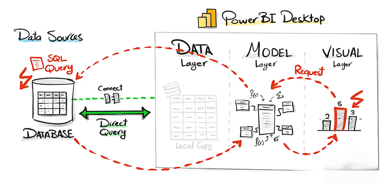

- In Direct query no full data is imported into the model,Instead queries are sent live to the underlying data source when visua;s are interacted with Data remains in the source,PowerBi acts as a query layer.
- In Direct query mode we can’t change the storage mode to import or dual because it is not supported.


---

-	In direct query mode we are not directly importing our data into the powerbi memory engine instead we are trying to see every time a particular visual or a particular report needs to refresh it hits to the backend data source whether it be sql or data model  or redshift to that your report or a visual is referring to all of your data  is directly to the system with out importing it onto your memory engine 
-	So every time a particular query or a particular refresh  is hit on your direct query kind of connectivity mode it  tries to run a query on your underlying data source and that’s where your visuals are being refreshed with whatever is the real time data that we have.
-	SO this particular data mode is pretty much closer to your real time data, it give accurate information which is  readily available and powerbi acts as your visual layer and nothing else.

## In direct query do we need to assign schedule refresh or not?

- Schedule refresh is available in direct query mode while we trying to refresh a particular data but it works quiet differently when compared to that import mode. So what happens when we try to schedule refresh in a direct query is even though a particular data is not refreshed in powerbi scheduled refresh is required for your schema refresh 

- Example: There is certain metadata schema that is kind od stored into your system while we are trying to create any visual , so it tries to identify underlying database column changes or it tries to identify that is there any particular objects or elements which are added from a data source standpoint,so in that level of criteria if we try to see it’s more or less like we need the scheduled refresh for identifying the schema changes also there could be certain cases where there would be requirement of credential refresh.

 For example when we are trying to connect  to a direct query mode we have our gate connections we have our authentication token certain cases.
-	SO in all of that particular criteria we try to see that a scheduled refresh would be required with in direct query


## Example of Direct Query Using MSSQl server


- In Powerbi Desktop -> Home Tab -> Data Group -> Get Data -> SQL Server


### Database Connections
When connecting to databases, powerbi offers two options: 
    - Import
    - DirectQuery

Here we have to make very important decision  because if you leave it as imports and later you change your mind and I would like to have it as direct query  well we can’t do that, once we say this as import it will stay as import ,but if we choose directquery  we can switch to import

    - Import mode is one way decision, you cannot switch later to direct query
    - Direct Query allows switching to import later 


-	We have to give server name, database name,  and select direct query
-	In the  advanced options sql statement we have to write query (select * from dbo.financials)
-	It’s highly advisable not to use like this sample query cause there could be a certain set of data itself that you might be requiring in it and not the entire set of data like only related columns that you would require set of columns when we are trying out to give out the sql statement in direct query as it pulls out only the required set of columns and indirectly helps out in eliminating the addtitonal or no required  so that we avoiding unnecessary data.

After Clicking on ok button 


- If We are working in projects we choose Database , usually we have username and password  which are created by database admins and click on connect
-	Since we are are using it in local system we choose windows and click on connect and press ok for encryption pop up


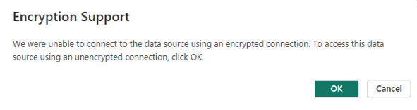


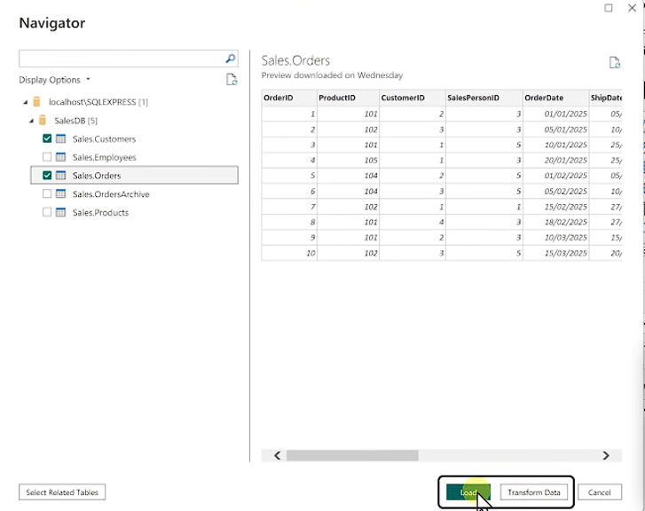

- Now we have data preview and select the tables and load 
- Here we are not loading the data itself because we are using direct query, so here just loading the structure(meta data) into Powerbi.
- So this loads  pretty fast  even our tables are really  big, cause we aren’t storing we’re establishing connection


- Based on the Icons on tables in the model view we can simply identify the tables how they loaded into powerbi.
- Now select one table and in the properties pane -> Advanced-> storage mode 
- Unlike import mode here we can change the storage mode 
Import or DirectQuery or Dual 

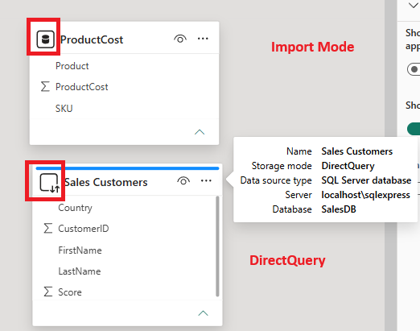


## How to change the storage mode in direct query?
- In order to change the storage mode we can select the type of connection we want to use for this table

- First select the table in model view and then in the Properties pane, under Advanced, find Storage mode.


### For Example:
Here we want to change storage mode for Sales Orders from DirectQuery to import.

So first click on the table and select on the table and in properties pane -> advanced-> storage mode -> select import.
Now powerbi gives you a pop up


And Changes it into import mode, it will do exactly as import it will go to the source and stores a local copy inside powerbi


## Limitation in DirectQuery
- In the table view we can’t see the data preview to quickly check your results.
- Many DAX functions , Calculated columns and modelling features are unavailable.
- Powerbi only reads the data and never modifies or manipulates  data in the source system


## Example:
We have connected the sql server in powerbi and added a visual and now want to update the database 


```sql
UPDATE Sales.Customers
SET Country=’USA’
WHERE CustomerID=1

```


•	Run this sql query and updated the database
•	Now when we come back to powerbi nothing changes with the visuals
•	And now when we try to create a new visual it will have updated data. 
•	 Now we can see we have fresh data without like    refreshing the data over here
The old visual holding old data and new visual holding new data . So what’s happening here ?


- Old Visual  


- new Visual 


In powerbi we have something called cache .So Powerbi going to store like small amount of data for each visual just to reduce the traffic that is going to the source system, if we are building a huge dashboard that is completely based on the direct query it will generate hundreds of queries to the database and we have a lot of users then you’re generate a massive traffic to the databases.So powerbi put a cache in every visual .


## So this is like import? What’s the difference between cache and import?


For cache it is only for one visual and for import it will applicable for entire visual
Cache is temporary , it will only be available for the session if we close the powerbi and opens the powerbi again it will fetch the data from data sources and creates a fresh new cache.

For Import once it loaded into powerbi even though we close the session and reopen it will be the same.

DirectQuery Incosistance
Because of caching we might have different versions of data 

## We can Manage cache?

File->Options andsettings->options-> Data load -> Data Cache Management Options


## Import vs DirectQuery

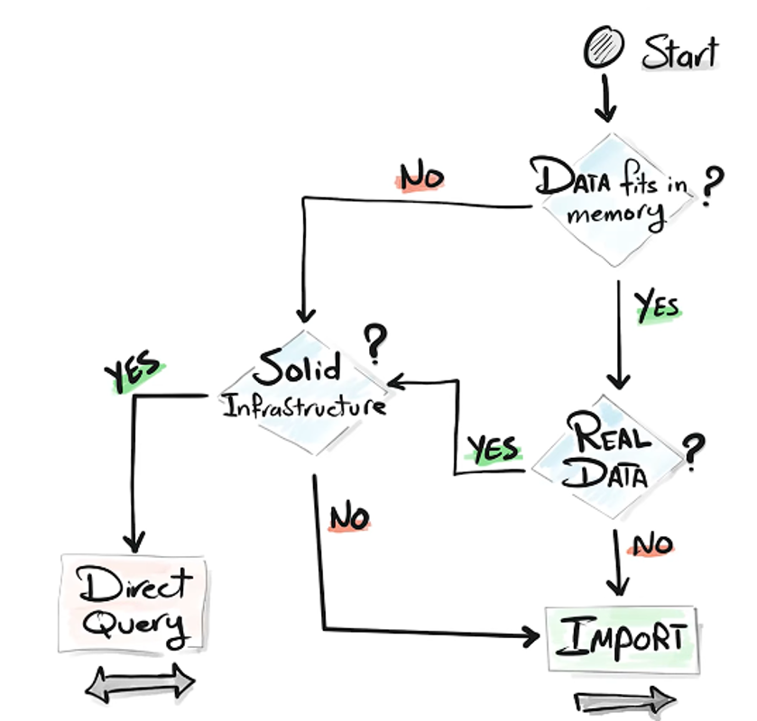


---


# PL-300 Scenario

A company has billions of transaction rows and requires near real-time reporting.

Best choice:

✅ DirectQuery

---

# 2.5 Dual Storage Mode

Dual mode allows a table to behave as:

* Import
* DirectQuery

depending on the query.

Used mainly for:

* Composite models
* Performance optimization

---

# Example

Dimension table:

Customer

Storage Mode:

Dual

Fact table:

Sales

Storage Mode:

DirectQuery


Powerbi decides on it’s own if import or direct query should be used.

If other tables are imported then powerbi uses import. Other wise it uses DirectQuery.

## How to Use Dual Mode?

In  Powerbi Go to model view and select table-> properties pane-> advanced->storage mode-> dual

- Really hard to predict  it is import or direct Query
- Dual Not recommended
- you can transition a table from Dual mode to DirectQuery or Import mode


## changing dual mode to import or direct query

- In order to change the storage mode we can select the type of connection we want to use for this table

- First select the table in model view and then in the Properties pane, under Advanced, find Storage mode.


---

# 2.6 Composite Models

A composite model combines storage modes.

Composite model =mixing tables with diffrent storage modes in one dataset(eg. some tables imported, some direcctquery, some dual)

- Hybrid tables: partitions of a table where recent data is queried live(Direct Query) while historical data is cached(Import)


Example:

Import: Product table

DirectQuery: Sales transaction table

---

A composite model can contain:

* Import tables
* DirectQuery tables
* Dual tables


## Why use composite models?

- Best of both : Performance + freshness + sccale
- Allows scenarios where part of daa needs real-time updates, part is static


---

# PL-300 Rule

Composite model:

= Multiple storage modes in one model

Dual mode:

= A table that can switch behavior

They are related but not the same.

---


## Live Connection Mode(No direct option in powerbi)

Powerbi Desktop Connects directly to a shared semantic model in the powerbi service

Semantic model -> data and model  this is shared one because we published it

In Live connection mode you caonnect an existing semantic model (eg: Sql server Analysis Services, Power BI dataset) and build reports on top of it without importing the data into your local model.

- Usecase: when you want to reuse a governed entrreprise semantic model and avoid duplication.
- Limitations:
    - No data layer in Desktop
    - No model layer in Desktop
    - Only report layer in Desktop
    - Cannot modify relationships or measures unless you own the original dataset
    


- `Semantic model`: A published dataset in the Power BI Service that contains both the data layer and the model layer (tables, relationships, measures, hierarchies).

- `Live connection`: When Power BI Desktop connects directly to this shared semantic model, without duplicating or importing the data/model locally.

- `Visual layer only`: Since the data and model already exist in the service, in Desktop you only build reports/visuals. No new data layer or model layer is created.


### How It Works
1. You publish a dataset (semantic model) to the Power BI Service.

2.In Power BI Desktop, you choose Get Data → Power BI datasets.

3. This creates a live connection to the published semantic model.

4. When you interact with visuals in Desktop, queries are sent to the semantic model in the service.

    - If the service dataset is in Import mode, queries hit cached data.

    - If it’s in DirectQuery mode, queries are pushed to the source system.

## Best Practice
One semantic model, many reports: Instead of creating multiple models for each report, publish a single well-designed model that can be reused across reports.

This ensures consistency, reduces duplication, and simplifies governance.

## Note
- In Desktop, you see only the report layer. The semantic model itself is not duplicated or editable — it remains in the service.

- You cannot modify relationships or measures unless you own and edit the original dataset.


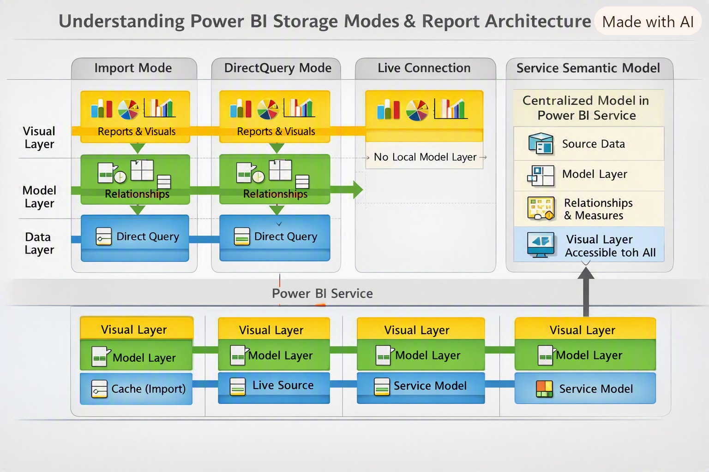


## Example Live Connection:


### Example : Reuse the shared semantic model to build new reports

Open blank report and-> get data -> more-> Microsoft Fabric->Power Bi semantic models

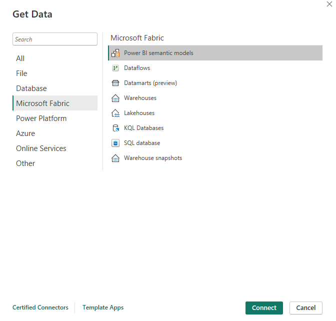


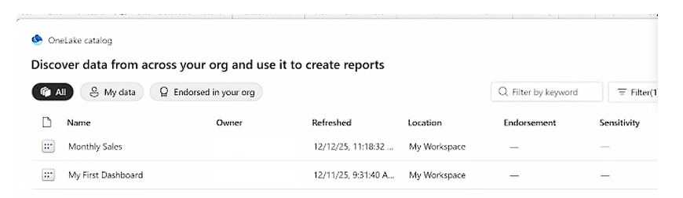


- After that we can see all every semantic model shared with you and ready for reuse.
- Note: The data and model in the service , Not on Desktop
- Table view is disabled in Live connection


- Symbol for live connection in model view 
- As we know we can’t transform and model the - data in live connection  we simply 
- Now create a visuals and publish it
- Here only report will be uploaded in powerbi service
- In the powerbi projects the developers changes semantic model  continuously  and at certain point we can’t say which model we choose to build report
- So powerbi created a Lineage view
- It shows full picture of how data flows and how components are connected


## Lineage View


-	In the Live connection mode either you’re not bringing your data to the model or you’re not hitting your database directly it’s kind of a data model  or a semantic model that you’re already creating as a powerbi data set and using that dataset as your report source that is called as live connection
-	When we try to use live connection mode it’s always like a semantic model for example  an SSAS cube or a tabular cube that we are trying to use as part of our live connection and using that  particular model it’s  more or less like you have established your entire structure of your model onto that particular model when I say the entire structure you have given your hierarchies you have provided the relationship between two entities 
-	You have given whether it is a single directional bidirectional and all of that criteria’s into your model and published it into powerbi service
-	Once your semantic model is published into your powerbi service so, once your semantic model  is published into your powebi service you create another report using that particular semantic model as your data source and try to bring in your data from that particular model  instead of hitting either the underlying data source or you’re avoiding the criteria where in you are bring your data onto the powerbi system that is increasing the storage capabilities of the powerbi systems.


## Which storage mode to  choose?

- Data size & growth : 
    - if dataset is small and manageable -> import
    - If huge or continuosly changing -> direct query
- Data freshness requirements :
    - Do you need real-time data? -> direct query
    - if you can work with daily/weekly  or periodic refresh -> import

- Query performance :
    - If you need fast interactions -> import
    - If you can tolerate slower queries -> direct query
- modeling needs :
    - If you need complex DAX calculations -> import
    - If you can work with limited modeling -> direct query
- Data source capabilities :
    - If source supports query folding -> direct query
    - If source has limited query capabilities -> import
- Source governance & security :
    - If source has strict access controls -> direct query
    - If source is less sensitive -> import
- architecture & infrastructure :
    - If you have robust infrastructure -> direct query
    - If you have limited resources -> import

`Golden rule`: Always try to use import until you can’t anymore


# 2.7 Power Query Overview

Power Query is Power BI's data preparation tool.

It is used before data enters the semantic model.

Power Query uses:

✅ M language

---

# Power Query Responsibilities

Use Power Query for:

* Cleaning data
* Transforming data
* Combining sources
* Removing unnecessary data

Examples:

* Remove duplicates
* Rename columns
* Change data types
* Split columns
* Merge tables
* Append tables

---

# Power Query Workflow

```id="89x9da"
Source Data

↓

Power Query Transformations

↓

Semantic Model

↓

DAX Calculations

↓

Report
```

---

# 2.8 Common Transformations

---

# Change Data Types

Example:

Text:

"100"

Convert to:

Number:

100

---

# Remove Columns

Remove unnecessary fields.

Benefits:

* Smaller model
* Better performance

---

# Remove Rows

Examples:

* Blank rows
* Errors
* Invalid records

---

# Split Columns

Example:

Full Name:

John Smith

↓

First Name:

John

Last Name:

Smith

---

# Pivot Columns

Convert rows into columns.

Example:

Before:

| Month | Sales |
| ----- | ----- |
| Jan   | 100   |
| Feb   | 200   |

After:

| Jan | Feb |
| --- | --- |
| 100 | 200 |

---

# Unpivot Columns

Convert columns into rows.

Common with Excel data.

---

# 2.9 Merge vs Append

Very common PL-300 topic.

---

# Merge

Purpose:

Combine tables horizontally.

Think:

SQL JOIN

Example:

Customer table:

| CustomerID | Name |
| ---------- | ---- |
| 1          | John |

Sales table:

| CustomerID | Amount |
| ---------- | ------ |
| 1          | 500    |

Merge result:

| CustomerID | Name | Amount |
| ---------- | ---- | ------ |
| 1          | John | 500    |

---

# Append

Purpose:

Combine tables vertically.

Think:

Stack rows.

Example:

January Sales

*

February Sales

=

All Sales

---

# Merge vs Append

| Merge                 | Append                   |
| --------------------- | ------------------------ |
| Combines columns      | Combines rows            |
| Requires matching key | Requires similar columns |
| Similar to JOIN       | Similar to UNION         |

---

# PL-300 Decision Rule

Need customer information added to sales?

✅ Merge

Need January + February sales combined?

✅ Append

---

# 2.10 Query Folding

Query folding is one of the most tested Power Query concepts.

---

# What Is Query Folding?

Query folding means Power Query pushes transformations back to the data source.

Example:

Power Query step:

Filter Sales where Year = 2026

Instead of:

```id="i1w5m5"
Load everything

↓

Filter in Power BI
```

Power BI sends:

```sql
SELECT *
FROM Sales
WHERE Year = 2026
```

to the database.

---

# Benefits of Query Folding

✅ Better performance
✅ Less data transferred
✅ Faster refreshes

---

# Sources That Support Folding

Common examples:

* SQL Server
* Azure SQL
* Databases

---

# Transformations That Often Break Folding

Examples:

* Certain custom functions
* Some complex transformations
* Python/R scripts

---

# PL-300 Rule

Query folding happens:

Before data reaches the semantic model.

---

# 2.11 Data Profiling

Power Query provides tools to understand data quality.

Tools include:

* Column quality
* Column distribution
* Column profile

---

# Used For:

Finding:

* Errors
* Null values
* Unexpected values
* Duplicates

---

# 2.12 Parameters

Parameters allow dynamic values in Power Query. Similare purpose as vraibles but for models.

Examples:

* File path
* Server name
* Date filters

---

# Example

Instead of:

```text
C:\Users\John\Sales.xlsx
```

Create:

```text
FilePath Parameter
```

Then change the parameter.

---

# Uses

Parameters help with:

* Reusable queries
* Environment changes
* Incremental refresh

---

# 2.13 Data Gateways

A gateway allows Power BI Service to access data stored on-premises.

Example:

```id="8u8zqk"
On-Prem SQL Server

↓

Gateway

↓

Power BI Service
```

---

# When Is Gateway Needed?

Usually:

On-premises data sources.

Examples:

* Local SQL Server
* File shares
* On-prem databases

---

# Cloud Sources

Usually do NOT require gateway.

Examples:

* Azure SQL
* SharePoint Online

---

# Gateway Types

## Personal Gateway

Used by individuals.

---

## Standard Gateway

Used by organizations.

Supports:

* Multiple users
* Shared connections
* Enterprise scenarios

---

# 2.14 Common PL-300 Exam Traps

---

## Trap 1

Connector and storage mode are the same.

❌ Incorrect

Connector = where data comes from

Storage mode = how Power BI uses it

---

## Trap 2

DirectQuery stores all data inside Power BI.

❌ Incorrect

DirectQuery queries the source.

---

## Trap 3

Merge adds rows.

❌ Incorrect

Merge adds columns.

---

## Trap 4

Append combines columns.

❌ Incorrect

Append combines rows.

---

## Trap 5

Query folding happens after loading data.

❌ Incorrect

Query folding happens during Power Query transformation.

---

## Trap 6

Gateway is needed for all data sources.

❌ Incorrect

Mostly needed for on-premises sources.

---

# Chapter 2 Practice Exam Questions

---

# Question 1

A company needs reports updated every few seconds from a database containing billions of rows.

Which storage mode should be used?

A. Import

B. DirectQuery

C. Dual

D. Cached

Correct Answer:

✅ B. DirectQuery

---

# Question 2

A developer needs to combine a Customer table with a Sales table using CustomerID.

Which transformation should be used?

A. Append

B. Merge

C. Pivot

D. Group By

Correct Answer:

✅ B. Merge

---

# Question 3

A company wants to combine January sales and February sales into one table.

Which transformation should be used?

A. Merge

B. Append

C. Relationship

D. Join

Correct Answer:

✅ B. Append

---

# Question 4

A Power Query transformation is pushed back to SQL Server for processing.

What feature is being used?

A. DAX

B. Query Folding

C. DirectQuery

D. Gateway

Correct Answer:

✅ B. Query Folding

---

# Question 5

A Power BI Service refresh needs to access an on-premises SQL Server.

What is required?

A. Bookmark

B. Gateway

C. Dashboard

D. App

Correct Answer:

✅ B. Gateway

---

# Question 6

A user wants to dynamically change a file path used by Power Query.

What should be created?

A. Measure

B. Parameter

C. Relationship

D. Bookmark

Correct Answer:

✅ B. Parameter

---

# Chapter 2 Summary

| Concept         | Purpose                         |
| --------------- | ------------------------------- |
| Connector       | Connect to data source          |
| Import          | Store data in model             |
| DirectQuery     | Query source directly           |
| Composite Model | Combine storage modes           |
| Dual Mode       | Flexible table storage          |
| Power Query     | Prepare data                    |
| DAX             | Calculate insights              |
| Merge           | Combine columns                 |
| Append          | Combine rows                    |
| Query Folding   | Push transformations to source  |
| Gateway         | Connect Service to on-prem data |

---

# Next Chapter

## Chapter 3 — Data Cleaning, Transformation, and Query Optimization
