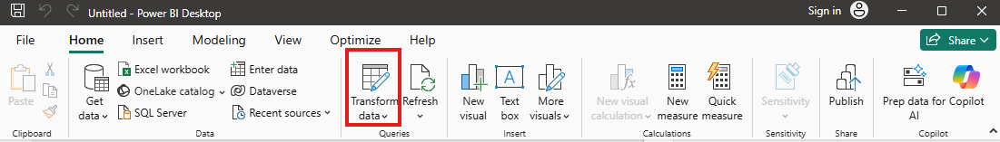
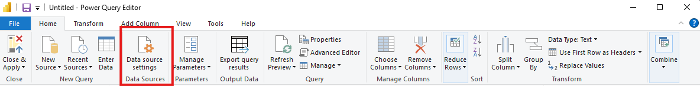
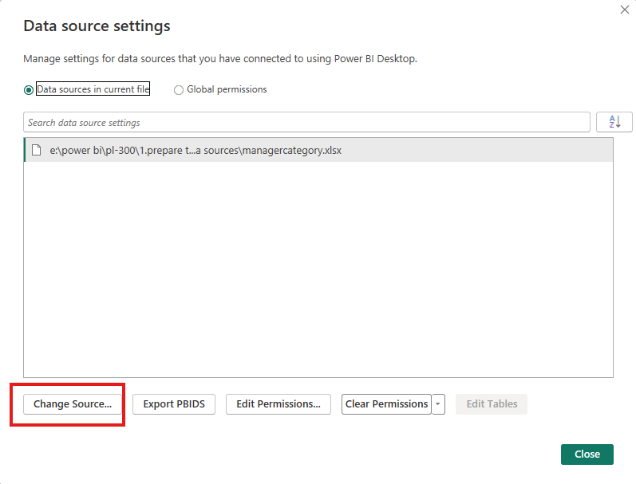
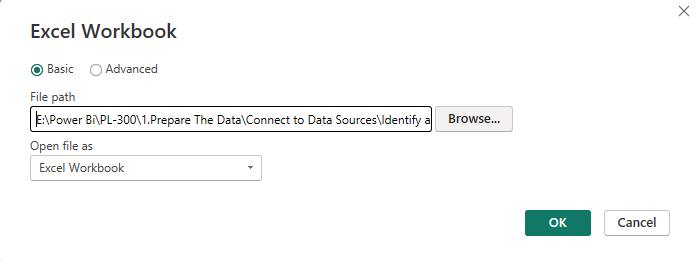
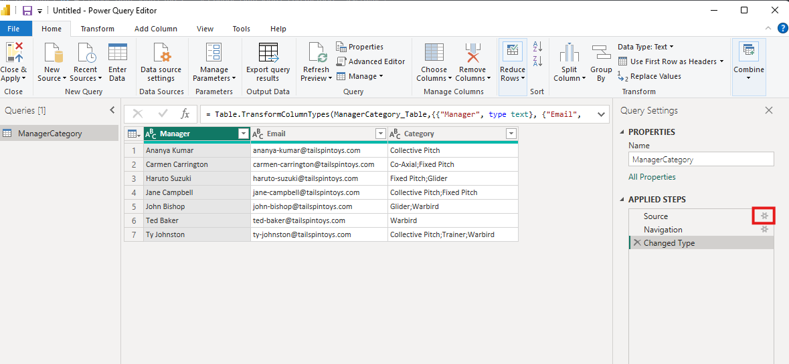
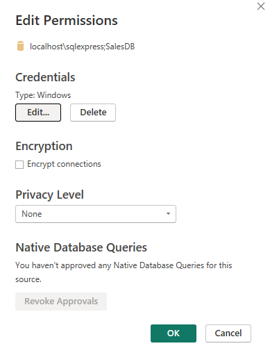
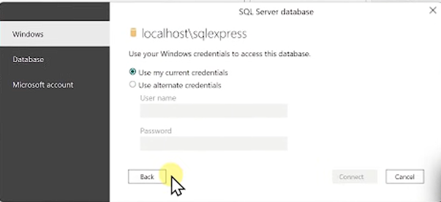

# Change Data Source Settings, Credentials, and Privacy levels

First, you need to change the data source settings, credentials, and privacy levels for your data sources. This is important to ensure that your data is being accessed correctly and securely.

[Change Data Source Settings](https://docs.microsoft.com/en-us/power-query/connectors/)

# Change Data Source Credentials

some data sources require credentials to access the data. You can change the credentials for your data sources by following these steps:

open powerbi desktop, go to the Home tab, and click on "Transform Data." This will open the Power Query Editor.

 

Open the Power Query Editor, go to the Home tab, and click on "Data Source Settings."

From there, you can select the Change source option to change the data source.

- After clicking on Change source, you can select the new data source and provide the necessary credentials to access it.

# Change Data source 2nd method

In the Power Query Editor, you can also change the data source by going to the "Applied Steps" pane on the right side of the screen.

Click on the gear icon next to the "Source" step. This will open the "Source" settings, where you can change the data source and provide the necessary credentials.

# Change Privacy Levels

### Summary of authentication Methods

- `Anonymous`: No credentials are required to access the data source. This is typically used for public data sources.
- `Basic`: Credentials (username and password) are required to access the data source. This is typically used for private data sources.
- `Windows`: Same Credentials are used to log in to Windows.
- `Database`: Credentials are required to access the database. This is typically used for data sources that are secured by database authentication.
- `Microsoft Account(Azure)`: Microsoft Azure credentials
- `Organizational Account`: Microsoft 365 account credentials

- `API key`: Connecting to REST API's from Power Query
- `OAuth2`: Connecting to REST API's from Power Query in Powerbi Through custom connectors.

- If a connector is not available for a data souce, then custom connector can be created using SDk.

Now we  go to power query editor 

## Change data credentials

For example , if you are using a SQL Server data source, you can change the credentials by following these steps:

1. In the Power Query Editor, go to the Home tab and click on "Data Source Settings."

2. Select the SQL Server data source and click on "Edit Permissions."

3. After clicking on "Edit Permissions," you can change the credentials for the SQL Server data source by providing the necessary information.

4. Click on  Edit and provide the new credentials for the SQL Server data source. After entering the new credentials, click on "OK" to save the changes.

### Identify and mange privacy settings on Data Sources

- privacy levels specify an isolation level that defines the degree thta one data source will be isolated from oher data sources.

- In order to have this functionality working, there must be at least 2 queries from different data sources.

- The functionality only works when we try to do either a `Merge operations or an Append Operation`

- These Operations can expose data from one data source to another data source

- Power Query works behind the scenes based on the privacy settigs on the data source. this can have an impact aon performance
- The purpose of the Data privacy Firewa;; is to prevent Power Query from unintentionally leaking data between sources.

### Manage Privacy setting

- `Private` : Data Sources set to private contain sensitive or confidential information. visibility can be restricted to authorized users.private data sources are completely isolated from other data sources, including other private data sources.
    - Example: Facebook data, a text file containg stock awards, or a workbook containing employee revies information.

- `Organizational` : Organizational dta asoiurces are isolated from all public data sources but are visible to other private and organizational data sources.Visibility is set to a trusted group.
    - Example: A Microsoft word document on an intranet SharePoint site with permisions enabledd for a trusted group

- `Public`: Public data sources are not isolated at all. Files,internet data sources, and workbook data can be set to Public Data can fold into other data sources. Visibility is available to everyone.
    - Example: Free data from the Azure Marketplace,data from a wikipedia page, or a local file containing data copied from a public web page.

 

 - There is a setting in Powerbi where we specify how do we want privacy levels

- Combining data according to your privacy level settings

